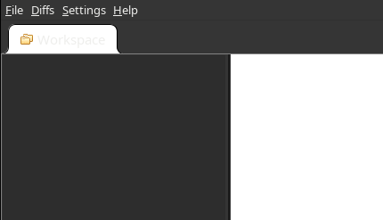
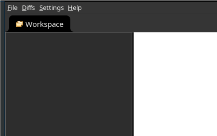

JInterpose
==========

`LD_PRELOAD`, but for Java applications.

This is a proof-of-concept.

This leverages the [Java Agent
feature](https://docs.oracle.com/javase/9/docs/api/java/lang/instrument/package-summary.html)
to instrument the application, and [ASM](https://asm.ow2.io/) to edit the code
at runtime.

The configuration is in [protobuf Text
Format](https://developers.google.com/protocol-buffers/docs/text-format-spec).
The format is defined in `com/pimzero/jinterpose/Proto.proto`.

While the user needs to keep in mind low-level Java details in mind while writing the configuration,
this project aims to describe the instrumentations/transformations in the configuration file.

Dependencies:

 - [asm](https://asm.ow2.io/)
 - [asm-common](https://asm.ow2.io/)
 - [protobuf-java](https://search.maven.org/artifact/com.google.protobuf/protobuf-java)

The build system is GNU Makefile, as I am not used to standard Java ecosystem
tools. This has the following drawbacks:
 - Dependencies versions need to be updated manually in the Makefile
 - Dependencies between files need to be explicitly defined manually

## Example

The initial goal of this project was to have a "pretty" dark-mode in bindiff.
While the `-Dswing.defaultlaf=com.sun.java.swing.plaf.gtk.GTKLookAndFeel` goes
a long way, there are still a few gaps. See for instance the "Workspace"
tab.

```
$ java -Dawt.useSystemAAFontSettings=on \
       -Dswing.aatext=true \
       -Dswing.defaultlaf=com.sun.java.swing.plaf.gtk.GTKLookAndFeel
       -jar /opt/bindiff/bin/bindiff.jar
```



With the help of a debugger, we can find that when creating a new tab, the
color is hardcoded to the `WORKSPACE_TAB_COLOR` field. With JInterpose, we can
interpose to use another field instead, such as
[java/awt/Color.BLACK](https://docs.oracle.com/javase/7/docs/api/java/awt/Color.html#BLACK).

```
$ cat example.textproto
action {
	when {
		and {
			expr {
				match {
					classname: "com/google/security/zynamics/bindiff/gui/tabpanels/TabPanelManager"
				}
			}
			expr {
				match {
					methodname: "addTab"
				}
			}
		}
	}
	do {
		field_interposition {
			src_owner: "com/google/security/zynamics/bindiff/gui/tabpanels/TabPanelManager"
			src_name: "WORKSPACE_TAB_COLOR"
			dst_owner: "java/awt/Color"
			dst_name: "BLACK"
		}
	}
}
$ # This is the same command as earlier, but with -javaagent:out/agent.jar=example.textproto to use the agent with the config
$ java -javaagent:out/agent.jar=example.textproto
       -Dawt.useSystemAAFontSettings=on
       -Dswing.aatext=true
       -Dswing.defaultlaf=com.sun.java.swing.plaf.gtk.GTKLookAndFeel
       -jar /opt/bindiff/bin/bindiff.jar
```



This works by applying all the transformations defined in the `do` section for
all the methods matched by the `when` close of the config.

For a list of supported actions, see
[com/pimzero/jinterpose/Proto.proto](com/pimzero/jinterpose/Proto.proto)
